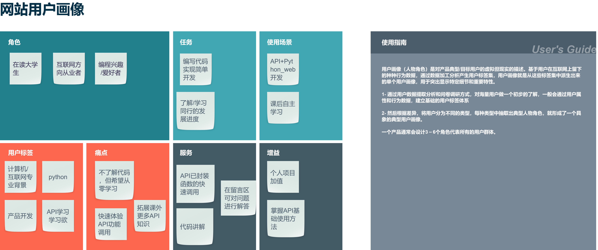

# Python-web_finalproject

<br/>

## 文档说明

|项目名称|[Python+API学习平台](http://maify.pythonanywhere.com/welcome)|
| --- | --- |
|云端部署|http://maify.pythonanywhere.com/welcome|
|作者|麦锋源|
|最后修订日期|2021-01-22|
|技术支持|[知识点汇总仓库](https://gitee.com/maifengyuan/python-coursework.git)|
|项目使用手册|待上传|
|**序号**|**目录栏**|
|1|[问题表述](#chapter1)|
|2|[解决方案](#chapter2)|
|3|[编程功能](#chapter3)|
|4|[云端部署](#chapter4)|
|5|[总结与感谢](#chapter5)|
|6|[项目开发问题收集](#chapter6)|

***

### 项目导览
1. 使用视频
[视频链接]()

2. 网页图片


<br/>

### 项目简介
本项目聚焦于以python语言学习群体，基于python-flask框架搭建的高德API实践交流网站。用户可通过登入网页后选择不同功能API进行学习和调用实践，并通过离线留言板进行疑难解答。以更直观、更多样化的方式输出网新专业相关知识，打造一个自主学习平台。

<div align=center></div>

<br/>

<h3 id="chapter1">一、问题表述</h3>

用户定位于python_web知识相关的初学者，主要使用场景课后自我拓展与API知识的实践，解决编程零基础入门的难题。



<br/>
用户旅程重点是说明对于Python+API知识通过网站自学的过程，现分为4个步骤：了解——尝试——掌握——交流与分享，用户的使用过程也是基于这4个方面循序渐进。
<br/>


<br/>
<br/>

<h3 id="chapter2">二、解决方案</h3>
本项目通过注册/登入系统，结合高德API、ALapi和Pyecharts图表三大模块与留言板组合而成，引导用户通过注册——浏览——实践——留言完成Python+API学习过程。网页主页使用Bootstrap模板搭建，其余板框利用HTML+CSS+java内容结合完成。

#### 功能架构图

<div align=center></div>

<br/>
<br/>

<h3 id="chapter3">三、编程功能的基本描述</h3>

#### 知识点涉及

1. HTML+CSS（难度：中等）
HTML需要掌握常用的功能，例如：按钮、input输入框、表单等；CSS则需要掌握3种样式的连接方式、页面内容及其布局的把控和大小颜色的设计等

```
div class="login_box">
                <form class="form-signin" method="Post" action="/test">
                    <tr><td><input type="text" name="phrase" id="inputEmail" class="form-control" placeholder="账号" required /></td></tr><label>账号</label>
                    </div>
                    <div class="login_box">
                        <tr><td><input type="password" name="letters" value="" id="inputPassword" class="form-control" placeholder="密码" required></td></tr><label>密码</label>
                    </div>
                    <a href="javascript:void(0)">
                    <button style="background-color:transparent;border-style:none;width:60px;height:30px;font-size:20px;color: white;" type="submit">登入</button>
                    </a>
                </form>
```

2. python基础知识点（难度：普通）
基本掌握字典，列表，切片以及循环的使用

```
# 循环
hello_viewlog():
	with open("view.log","r") as log:
		contents = []
		for item in log:
			contents.append([])
			for i in item.split("|"):
				contents[-1].append(escape(i))
	# return str(contents)
```
```
# 切片
user_input_geocode = request.form['key_geocode']
	con_input_geocode = request.form['add_geocode']
	geotwo = geocode(user_input_geocode,con_input_geocode)
	country2 = geotwo["geocodes"][0]['country']
	province2 = geotwo["geocodes"][0]['province']
	city2 = geotwo["geocodes"][0]['city']
	district2 = geotwo["geocodes"][0]['district']
	adcode2 = geotwo["geocodes"][0]['adcode']
	location2 = geotwo["geocodes"][0]['location']
```

3. Flask框架与第三方模块（难度：偏难）

```
from flask import Flask,render_template,request,jsonify,escape,redirect,url_for
from panduan import panduan_login
from geo import weatherInfo,geocode
from pymysql import connect
import pandas as pd
import time
from alapi import duwei
import requests
from random import random
from charts import mapcity
from pyecharts import options as opts
from pyecharts.charts import Map
from pyecharts.faker import Faker
```

4. API调用（难度：偏难）

```
def mapcity():
    c = (
        Map()
        .add(
            "",
            [list(z) for z in zip(ducity,dunum)],
            "china-cities",
            label_opts=opts.LabelOpts(is_show=False),
        )
        .set_global_opts(
            title_opts=opts.TitleOpts(title="2018dujioashou"),
            visualmap_opts=opts.VisualMapOpts(),
        )
        
       # .render_notebook()
     # .render("2018独角兽企业城市分布数量.html")#生成HTML文件，可在浏览器打开
    )
    return c.render()
```

5. 数据库MySQL（难度：中等）

```
conn = connect("localhost","root","@2916(Maify)","logmess")
cursor = conn.cursor()
sql = "select * from stuaccount"
read_row = cursor.execute(sql)
login_information = cursor.fetchall()
```

6. 云端部署（难度：普通）

<br/>

#### 学习周期
|对于序号|学习成本|备注|
| --- | --- | --- |
|1|零基础：一周；一定基础：2天|利用html实现网页设计入门可能会花一段时间，当对代码逻辑和各组件有一定了解后上手会较快，后期可以合理利用框架进行项目开发|
|2|零基础：三周；一定基础：3天左右|Web开发在对数据的处理上使用Python较多，针对类似循环和切片的功能要求有一定的掌握|
|3|零基础：两周；一定基础：5天左右|flask需要理解数据传递的逻辑，这对于代码的开发与后期维护都起很大作用，第三方模块则需要掌握安装、调用即可|
|4|零基础：两周；一定基础：一周左右|API知识不容易上手，熟悉调用方法后基本是按同一个逻辑操作，不同功能的使用难度跨度较大|
|5|零基础：一周；一定基础：2天|数据库对于简单的Web开发只需要掌握简单的增、删、改、查即可|
|6|零基础：4天左右；一定基础：2天左右|云端部署要记住关键的操作，同时要熟悉console中的命令|

<br/>
<br/>

<h3 id="chapter4">四、云端部署的基本描述</h3>

|页面|说明|预览|
| --- | --- | --- |
|注册与登录系统|以表单形式将数据传入数据库中，通过信息匹配完成注册到登入的步骤|[注册页](http://maify.pythonanywhere.com/add_stu)，[登入页](http://maify.pythonanywhere.com/dengru)|
|日志系统|在免费API测试功能结果中添加日志系统，记录用户的搜索记录，并传入指定文件|[日志页](http://maify.pythonanywhere.com/viewlog?)|
|高德功能主页|详细页中设置链接通过添加数据实现免秘钥功能调用||
|ALapi功能主页|详细页中设置链接实现一间功能调用|[页面链接](http://maify.pythonanywhere.com/test)|
|Pyecharts主页|详细页中设置链接将案例图片以html文件形式保存至本地||
|留言板|用户通过留言板随时添加离线形式的留言信息，并生成发布时间|[留言板](http://maify.pythonanywhere.com/say/)|

#### 数据流程图

<div align=center></div>

<br/>
<br/>

<h3 id="chapter5">学习/实践心得总结及感谢</h3>
Python期末项目相当于对整个学期的知识进行总结运用，在开发与实践过程中自己受益匪浅，待代码逻辑的不断学习与打磨减少了自己在面对困难时的恐惧感，多增加了一份探索和求知的欲望。此外，这次的项目也让自己认识到需要的不足，包括网页设计、网页体验流畅性和对数据的处理等，对自己的产品思维上有很多的启发。最后，感谢老师的耐心教导和同学们的帮助。

#### 项目汇总
- HTML文件：18项
- CSS样式文件：4项
- Py文件：5项（3份API文件，1份数据库文件，1分web主函数）

***

<h3 id="chapter6">六、项目开发问题收集</h3>
|问题|解决方案|
| --- | --- |
|待更新|待更新|
